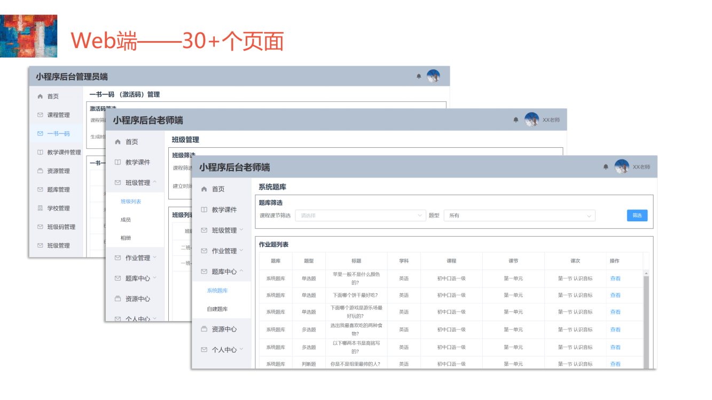

# 中华写字课堂

## （1）项目介绍

​		本项目（中华写字课堂）由南开大学软件学院18级本科生张志强、刘雨缇、陈画画、许诺于2020年暑期实训开发，具体负责如下：

​				**小程序端：刘雨缇、陈画画**

​				**web端：    张志强**

​				**后端：        许诺**

​		中华写字课堂提供英语、语文、数学等学科的课程及配套的教材和课后作业及测试习题。部分课程仅购买了课程的学校老师和学生可以使用教材和习题，习题涉及的题型比较多，包括拖拽题、语音自动评分题、写字拍照自动评分题、拍照语音文字气泡题等复杂的题型。因此需要一个主要给课程内部老师、学生及家长使用的作业辅学系统，以完成身份认证，老师分发、收集、批改作业，学生完成作业并获得反馈以及家长了解学生学习情况等功能。


## （2）技术选择

#### 小程序端

	1. 框架：vue+uni-app
 	2. ui: uview-ui

1. 包管理工具: npm

#### web端

1. 框架：Vue.js
2. ui: element-ui
3. 包管理工具：npm

#### 后端

1. 框架：python + Django + Django REST Framework

#### 前后端链接

1. axios


## （3）成果展示

#### 	小程序端


​		具体见视频wechat.MP4

#### 	web端



​		具体见视频web.MP4

## （4）文档地址：

https://www.yuque.com/books/share/defc9b42-b4b9-4eed-a2bf-3825c1d0ef12?# 《中华写字课堂文档》


## （5）环境配置

- 确保开发环境处于联网状态


#### 1）Docker Desktop for Windows安装

1. **系统要求：**

- Windows 10 64位：专业版，企业版或教育版（Build 15063或更高版本）。
- 在BIOS中启用虚拟化(各个主板的BIOS的操作面板不同，可咨询主板商)。通常，默认情况下启用虚拟化。

- 具有CPU SLAT功能。
- 至少4GB的运行内存。

- 启用Hyper-V


1. **docker运行时出现Out of Memory的情况，将Memory设置为较小值**


#### 2）Node.js安装

（**1）下载****Node.js v12.18.1-x64****：**(或者晚于此的版本)

- 下载地址：https://nodejs.org/en/download/


**（2）安装Node.js**

1. 按提示完成安装
2. 测试安装是否成功运行CMD或PowerShell，分别输入**node -v** 和 **npm -v**分别查看node和npm的版本号，如下图所示

​      


#### 3）安装微信小程序开发者工具

1. 下载地址：https://developers.weixin.qq.com/miniprogram/dev/devtools/download.html
2. 选择稳定板for windows 64

1. 按提示进行安装
2. 在设置中将服务端口打开

​    

#### 4）HBuilderX安装

1. 下载地址：https://www.dcloud.io/hbuilderx.html


1. 解压后直接运行


1. 在工具->设置里，把微信开发者工具的安装目录配置好


### 在开发环境中运行

#### 1）获取源代码

- 源代码地址：https://se.jisuanke.com/ChineseWritingClass/nightmare/zhxzkt.git

#### 2）运行后端

进入zhxzkt目录下

```
docker-compose build
docker-compose run --rm django python example/manage.py migrate
docker-compose run --rm django python example/manage.py collectstatic --no-input
docker-compose down
docker-compose up
```

打开http://localhost/backend/api/test/2，出现如下类似信息则部署成功


#### 3）运行web端

1. 安装包依赖

进入zhxzkt/frontend目录下

```
npm install
```

如果担心下太久，可以更换国内源

```
npm install --registry=https://registry.npm.taobao.org
```

也可

```
npm config set registry https://registry.npm.taobao.org
npm install
```

1. 将src/main.js 如图所示代码中的ip地址换成你部署后端服务的域名或ip地址，本机则为localhost即可

​    

1. 运行

- 在开发环境下运行

```
npm run serve
```

打开给出的网址

- 打包运行

build

```
npm run build
```

在dist文件夹内找到index.html，在浏览器中打开

#### 3）运行小程序端

1. 安装依赖

进入zhxzkt/miniprogram目录下

建议对node-sass更换国内源

更换registry同web端

```
 npm install --sass_binary_site=http://cdn.npm.taobao.org/dist/node-sass --registry=https://registry.npm.taobao.org
```


1. 将src/App.vue 如图所示代码中的localhost换成你部署后端服务的域名或ip地址，本机则为localhost即可


1. 使用HBuilderX打开项目

点击文件->打开目录，选择zhxzkt/miniprogram文件夹

  

1. 运行

- 在开发环境中

在微信开发者工具中，点击运行->运行到小程序模拟器->微信开发者工具，若之前没有设置微信开发者工具安装目录，第一次会要求选择微信开发者工具安装目录

​      

- 打包运行


在微信开发者工具中，点击发行->小程序-微信  

