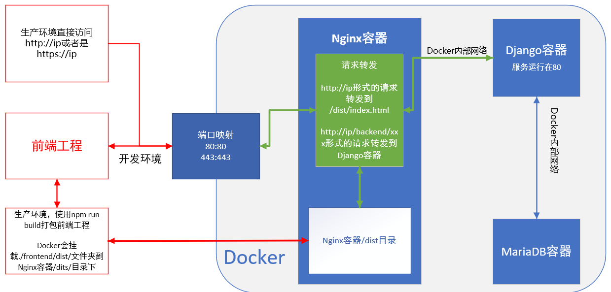

# Docker大礼包

> 语言: [English](./README.md) | [中文](./doc/README_zh_CN.md)

*请小心使用该项目*

*如果发生了错误，可能是这个环境的锅。*

*你是对的！*
*相信自己！！*

## 简介

基于Django的web应用的Docker环境

- Django应用由Gunicorn提供。
- 使用Nginx来作为反向代理、静态文件服务器。静态文件被持久化储存在目录下。
- 该环境使用了Mariadb，数据被持久化存储在本地文件中。
- 通过pipenv管理python的依赖，使用了Pipfile和Pipfile.lock。

该项目同时提供了一个Makefile。在使用时可能需要运行`sudo make`而不是`make`，因为docker命令和docker-compose命令通常需要使用管理员权限。

## 依赖

你需要安装[Docker](https://www.docker.com/) 和 [Docker-Compose](https://docs.docker.com/compose/)。

## 快速上手

### 后端服务

当你第一次使用该项目时，你应该一步步执行下边的命令。

**小贴士：如果你更改了项目的名称，你应该将下方命令中的[example]更改为你自己的项目名称。**

```shell
docker-compose build
docker-compose run --rm django example/manage.py migrate
docker-compose down
docker-compose run --rm django example/manage.py collectstatic --no-input
docker-compose down
docker-compose up
```

服务端会运行在容器的`8000`端口，你可以通过访问[localhost/backend/admin/](localhost/backend/admin/)来访问后端服务。

当你想要停止服务端时：

```shell
django-compose down
```

### 前端服务

- 当你在开发环境下，通过运行下方的命令来启动前端服务。

```shell
cd frontend
npm run serve
```

当命令执行完成后，你可以通过在浏览器中输入 [localhost:8080](localhost:8080) 去访问你的前端页面。

- 当你在生产环境下，通过运行下方的命令来部署前端服务。

```shell
cd frontend
npm run build
```

当命令执行完成后，你可以通过在浏览器中输入 [localhost](localhost) 来访问生产环境下的前端页面。

## 命令

### Build

`docker-compose build` 或者 `make build`（Linux或者是安装了GNU make命令的Windows系统适用）

### Migrate

`docker-compose run --rm django example/manage.py migrate` 或者 `make migrate`（同上）

### Collect static files（配置静态文件）

`docker-compose run --rm django example/manage.py collectstatic --no-input` 或者 `make collectstatic` （同上）

### Run

`docker-compose up` 或者 `make run`（同上）

### 创建新的app

`docker-compose run --rm django /bin/bash -c "cd example && python manage.py startapp <you app name>"`

### 执行任意一条另外的命令（在Django容器中）

`docker-compose run --rm django /bin/bash -c "<You command>"`

使用`docker-compose up -d`在后台运行服务端。

### Tests

- `make test`
- `make checksafety`
- `make checkstyle`
- `make coverage`
- 使用 `make check` 去检查安全性和代码风格

## 更多配置

### 使用自己的后端项目名

当你想要使用你自定义的项目时，你应该按照下边的方法配置你的项目

1. 在这些文件中，使用**your project file name**更换**example**：

    `docker-compose.yml`, `Makefile`, `Dockerfile`, `tox.ini`, `/django/config/gunicorn/conf.py`

2. 在你的项目中修改`settings.py`文件：

    把下边这行代码加到**settings.py**中的`import os`后边

    ``` python
        _env = os.environ
    ```

    Then configure the database part with:

    ``` python
        DATABASES = {
            'default': {
                'ENGINE': 'django.db.backends.mysql',
                'USER': _env['DB_USER'],
                'PASSWORD': _env['DB_PASS'],
                'NAME': _env['DB_NAME'],
                'HOST': 'database',
                'PORT': _env['DB_PORT'],
                'OPTIONS': {
                    # 存储引擎启用严格模式，非法数据值被拒绝
                    'init_command': "SET sql_mode='STRICT_TRANS_TABLES'",
                    'charset': 'utf8mb4',
                },
            }
        }

    ```

3. 使用`docker-compose up`启动项目

### 使用自己的后端接口名

项目后端接口默认为`backend/api/`，如果你想要替换`backend`为其他的名称，你需要做如下的工作

1. 在`./config/nginx/nginx_env`中，修改第5行`URL_PERFIX=/backend`中的`backend`为你定义的名称

2. 在`./config/django/django_env`中，修改第6行`URL_PREFIX=/backend`中的`backend`为你定义的名称

3. 在前端的项目文件夹中，修改`./frontend/.env.development`和`./frontend/.env.production`中的后端URL

4. 重新`docker-compose up`

### 配置你的数据库、Django和端口映射

你可以通过在`./config/db/db_env`文件中为MariaDB容器修改一些基本配置，在`./config/django/django_env`文件中为Django容器修改一些配置。

在生产环境下，你应该在`docker-compose.yml`['services']['nginx']['ports']中配置端口映射

### 前端项目配置

在前端项目文件夹`./frontend/`中，有三个文件`.env`，`.env.development`，`.env.production`，这些文件配置了后端请求的URL，可以根据自己的需要在部署时更改

### 配置你的Nginx

Nginx的配置文件在`./config/nginx/nginx_env`文件中，有一些关于Nginx的基本配置

## 这玩意儿是怎么工作的



## 参考文献

- [使用docker-compose部署nginx+gunicorn+mariadb的django应用](https://www.lagou.com/lgeduarticle/52228.html)
- [Docker for Django(Nginx and MySQL)](https://medium.com/@kenkono/docker-for-django-nginx-and-mysql-5960a611829e)
- [Dockerizing Django with Postgres, Gunicorn, and Nginx](https://testdriven.io/blog/dockerizing-django-with-postgres-gunicorn-and-nginx/)
- [Docker Compose with NginX, Django, Gunicorn and multiple Postgres databases](https://pawamoy.github.io/posts/docker-compose-django-postgres-nginx/)
